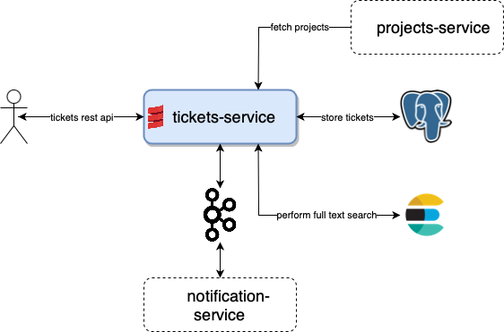

# Monitoring with Scala, part 1: OpenTelemetry


## Introduction

### First part
This blog post is just first of series of articles, aimed to show landscape of metrics, telemetry and APM solutions possible to use in different
Scala ecosystems. I possibly won't cover all possible solutions or combination of those, but will try to cover main one.

As title says, in this particular post, we will focus on OpenTelemetry framework.

Please, NOTE: this series is not going to compare telemetry as whole products between each other,
instead it focuses on how to use each telemetry product in different Scala ecosystem and perhaps highlight some
pitfalls from this perspective only.

All source code can be found in [this repository](https://github.com/IvannKurchenko/blog-telemetry).

### Concepts
But before moving forward, it's worth to mention that monitoring or telemetry is pretty wide technical topic.
Off course, I won't be able to cover it all. But, in order to be on the same page, first let's introduce some short list of main concepts I'm going to refer to.

Definitions could differ from source to source, so I try to give some average notion:
- Metrics - abstract signals sent from service, resource etc.  
- Spans - data about single logical unit execution. For instance: timings about service method execution. 
- Trace - data about single logical transaction execution. For instance: handling HTTP request. 
- Instrumentation - any tools or libraries, which understand specifics of certain service stack of technologies they run inside and able to scrap valuable metrics or spans. 
- Agent - service collecting or scrapping data from target services or resources.
- APM (application performance monitoring) - complex software solution capable to store, visualise, alert about etc. received metrics. For example: Splunk, NewRelic etc.

Overall, when we're talking about any telemetry solution, we usually mean build complex solution consisting of
certain instrumentation, agent/storage and visualisation/APM solution.
Schematically it showed on picture below:


### Ecosystems
Following ecosystems are going to be considered:
- Lightbend - mostly known for `akka` and surrounding projects, such as `akka-http`, `akka-streams` etc.;
- Typelevel - ecosystem build on top of `cats-effect` library, such as `fs2`, `doobie`, `http4s` etc.

Looking ahead, this and next post are focused on Lightbend stack, and third will describe monitoring in Typelevel stack. 


## System under monitoring
In order to compare how to plug and use certain telemetry solutions for end-service, let's consider single example service:
task ticketing system, similar to well known Jira or Asana. Domain model is pretty simple - there is `Ticket`
representing single task and `Project` which contains multiple tickets.
This system at high level, consist of microservices responsible for projects management (`projects-service`),
tickets management (`tickets-service`) and tickets change notifications, e.g. emails (`notification-service`).
Since there are plenty of stuff to monitor, let's keep our focus on `tickets-service` - the abstract service we are going
to monitor

For the sake example, task tickets system is much simplified comparing to real world production system and
does not include auth, caching, some services are stubbed at all.
Along with that, tech stack has been chosen to be more or less diverse to simulate real production system to some extent,
hence certain architectural decisions might not look perfect.

Task ticketing system which we are going to monitor looks following at high level:



- `tickets-service` - micro-service for tasks tickets, also provides full text search capabilities, publish change to kafka topic
- `notification-service` - micro-service for user subscriptions, send emails for subscribed tickets.
- `projects-service` - micro-service for projects, which tickets are leave in.

### `tickets-service` API
<br>`GET /v1/tickets?search={search-query}&project={}` - performs full text search over all tickets
<br>`POST /v1/tickets` - create single ticket
<br>`PUT /v1/tickets` - update single ticket
<br>`DELETE /v1/tickets/:id` - delete single ticket

Example ticket model is following:
```json
{
  "id": 1,
  "project": 2, 
  "title": "ticket title",
  "description": "ticket title",
  "createdAt": 1644560213,
  "createdBy": "john.doe@acme.com",
  "modifiedAt": 1644560213,
  "modifiedBy": "john.doe@acme.com"
}
```

Please, note: implementation of exact service depends on stack we consider, but overall architecture remains the same
for entire series.

### Things to monitor
For sake of example let's suppose we would like get following data from our telemetry:
- HTTP requests spans - timings and details about each request handling;  
- Number of tickets metric - custom metric showing number of existing tickets. 

### Simulating user traffic
To get some data for any telemetry from `ticket-service` we need to send number of requests.
I decided to use [Gatling](https://gatling.io) for this. Despite the fact that this is rather load and performance
testing tool, let's omit testing aspect and use it just to simulate user traffic.
Following scenario for single user is used to put some load on service:
- Create 20 tickets for 10 different projects;
- Search tickets for 10 different projects;
- Update 20 tickets;
- Delete 30 tickets;

### Implementation details
Following libraries and frameworks were used to implement `tickets-service` in Lightbend ecosystem:
- `akka-http` - for HTTP server and client;
- `slick` - for database access layer, along with Postgre JDBC driver;
- `elastic4s` - not really library supported by Lightbend, but it provides convenient Scala API, abstracted over
  underlying effect, hence can be used with `Future`, which is our case.
- `kafka` - plain Java client to write records to `tickets`.

## OpenTelemetry

### Instrumentation
[OpenTelemetry](https://opentelemetry.io/docs/) is, as documentation says:
>OpenTelemetry is a set of APIs, SDKs, tooling and integrations that are designed for the creation and management of telemetry data such as traces, metrics, and logs.

As you may see, nothing Scala specific and so far it has no dedicated support for variety of Scala libraries, but luckily it provides [number of JVM instrumentation]((https://opentelemetry.io/docs/instrumentation/java/)).
In particular for `ticket-service` case, we are interested about following instrumentation:
"Akka HTTP", "JDBC", "Elasticsearch Client", "Kafka Producer/Consumer API"

_Despite the fact list pretty long, I strongly encourage you to check if it fits your particular needs._

### Export 
OpenTelemetry designed in a way that instrumentation is abstracted over backend it exposes metric to.
Such approach allows supporting variety of exporters, both pull and push based. See [Data Collection](https://opentelemetry.io/docs/concepts/data-collection/) page for more details.
We will consider following exporters in examples: Zipkin, Jaeger and Prometheus.

Talking about APM solutions, there are number of services natively supporting OpenTelemetry, such as: 
[Splunk](https://www.splunk.com/en_us/observability/apm-application-performance-monitoring.html), [Datalog](https://docs.datadoghq.com/tracing/setup_overview/open_standards/) etc.


### Automatic tracing
OpenTelemetry has nice documentation [how to plug automatic instrumentation](https://opentelemetry.io/docs/instrumentation/java/automatic/)
Taking into account sbt specifics, it is possible to do with following way:
[sbt-javaagent](https://github.com/sbt/sbt-javaagent) - use plugin to run app with `javaagent` parameter
Add to `plugin.sbt`
```scala
addSbtPlugin("com.lightbend.sbt" % "sbt-javaagent" % "0.1.6")
```
And add following line for project settings:
```scala
javaAgents += "io.opentelemetry.javaagent" % "opentelemetry-javaagent" % "1.11.0"
```

### Custom metrics
https://opentelemetry.io/docs/instrumentation/java/manual/


### Metrics only example: Prometheus + Grafana

### Tracing only example: Zipkin

### APM Example: Splunk 
Splunk APM product natively supports [OpenTelemetry](https://opentelemetry.io) for instrumentation.


## Conclusion
Choose APM or Telemetry tool based on your infra, it should not be limited only to single eco-system.
Next - Typelevel

## Links
- [Getting Started With OpenTelemetry](https://dzone.com/refcardz/getting-started-with-opentelemetry)
- [OpenTelemetry JVM instrumentation](https://opentelemetry.io/docs/instrumentation/java/)
- [OpenTelemetry supported JVM libraries](https://github.com/open-telemetry/opentelemetry-java-instrumentation/blob/main/docs/supported-libraries.md)
- [Splunk APM agent docker installation](https://docs.splunk.com/Observability/gdi/opentelemetry/install-linux.html#linux-docker)
- [Instrument Java applications for Splunk Observability Cloud](https://docs.splunk.com/Observability/gdi/get-data-in/application/java/get-started.html#nav-Instrument-a-Java-application)
