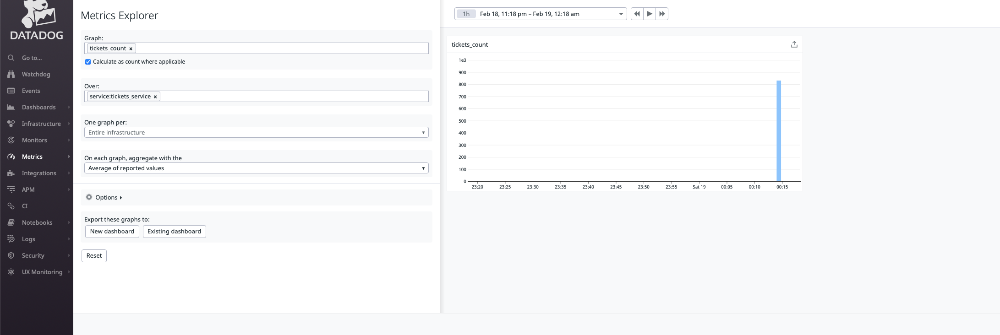

# Telemetry with Scala, part 1: OpenTelemetry


## Introduction

### First part
This blog post is the first of a series of articles, aimed to show a landscape of metrics and telemetry solutions possible to use in different
Scala ecosystems, including some examples of APM solutions.  I possibly won't cover all possible solutions or a combination of those but will try to cover the main one.

Please, NOTE: this series is not going to compare telemetry as whole products between each other,
instead it focuses on how to use each telemetry framework in different Scala ecosystem and perhaps highlight some pitfalls from this perspective only.

Since this is quite a large topic to discuss, just a small portion of code samples are present here. Please, see
[this repository](https://github.com/IvannKurchenko/blog-telemetry) for complete results. 

As the title says, in this particular post, we will focus on OpenTelemetry framework.

### Concepts
But before moving forward, it's worth mentioning that monitoring or telemetry is a pretty wide technical topic. Of course, I won't be able to cover it all. But, to be on the same page, first, let's introduce a shortlist of main concepts I'm going to refer to.
Definitions could differ from source to source, so I try to give some average notions:
- Metrics - abstract signals sent from service, resource, etc.
- Spans - data about single logical unit execution. For instance: timings about service method execution. 
- Trace - data about single logical transaction execution. For instance: handling HTTP requests. 
- Instrumentation - any tools or libraries, which understand specifics of certain service stack of technologies they run inside and can scrap valuable metrics or spans. 
- Agent - service collecting or scrapping data from target services or resources.
- APM (application performance monitoring) - complex software solution capable to store, visualize, alert about, etc. received metrics. For example Splunk, NewRelic, etc.

Overall, when we're talking about any telemetry solution, we usually mean building a complex solution consisting of certain instrumentation, agent/storage, and visualization/APM solution.
Schematically it showed in picture below:


### Ecosystems
Following ecosystems are going to be considered in series:
- Lightbend - mostly known for `akka` and surrounding projects, such as `akka-http`, `akka-streams` etc.;
- Typelevel - ecosystem build on top of `cats-effect` library, such as `fs2`, `doobie`, `http4s` etc.

Looking ahead, this and the next post are focused on Lightbend stack, and the third will describe monitoring in Typelevel stack.

## System under monitoring
To compare how to plug and use certain telemetry solutions for end-service, let's consider a single example service: a task ticketing system, similar to well-known Jira or Asana.
The domain model is pretty simple -  there is `Ticket` represents a single task and `Project` which contains multiple tickets.
This system at a high level consists of microservices responsible for projects management (`projects-service`),
tickets management (`tickets-service`) and tickets change notifications, e.g. emails (`notification-service`).
Since there is plenty of stuff to monitor, let's keep our focus on `tickets-service` only. 
The `projects-service` is stubbed in our case and provides API just to fetch project by its id.
The `notification-service` shown as theoretical service.

For the sake of example, the task tickets system is much simplified compared to the real-world production system and does not include things like auth, caching, load balancing, etc.
Along with that, the technical stack has been chosen to be more or less diverse to simulate a real production system to some extent, hence certain architectural decisions might not look perfect.

Task ticketing system which we are going to monitor looks following at a high level:


- `tickets-service` - micro-service for tasks tickets, also provides full-text search capabilities, publishes a change to Kafka topic.
- `notification-service` - micro-service for user subscriptions, send emails for subscribed tickets. Just show Kafka intention, is not present in implementation.
- `projects-service` - micro-service for projects, which tickets are leave-in. Stubbed with static data.

Please, note: implementation of exact service depends on the stack we consider, but the overall architecture remains the same for the entire series.

### `tickets-service` API
The example ticket model is following:
```json
{
  "id": 1,
  "project": 2, 
  "title": "ticket title",
  "description": "ticket title",
  "createdAt": 1644560213,
  "createdBy": "john.doe@acme.com",
  "modifiedAt": 1644560213,
  "modifiedBy": "john.doe@acme.com"
}
```

`tickets-service` exposes following API endpoints.
<br>`POST /v1/tickets` - create a single ticket:
- Request project by `project` id field from `projects-service` to verify project exists; 
- Insert a record into Postgre `tickets` table;
- Index ticket  document into `tickets` Elasticsearch index;
- Send message to Kafka `tickets` topic identifying ticket created event;

<br>`GET /v1/tickets?search={search-query}&project={project-id}` - performs a full-text search over all tickets:
- Search tickets by `title` and `description` in Elasticsearch;
- Fetches full ticket records from Postgre `tickets` table by found `id`'s from Elasticsearch;

<br>`PUT /v1/tickets` - update single ticket: 
- Update a record in Postgre `tickets` table.
- Index ticket  document into `tickets` Elasticsearch index;
- Send message to Kafka `tickets` topic identifying ticket updated event;

<br>`DELETE /v1/tickets/:id` - delete single ticket: 
- Delete ticket by id from both Postgre and Elasticsearch;

### Things to monitor
Moving to data we would like to get from our telemetry:
- HTTP requests spans - timings and details about each request handling. Ideally, to get traces about how much time the application spends in.
- Tickets count - custom metric showing number of existing tickets. 

### Simulating user traffic
To get some data for any telemetry from `ticket-service` we need to send some requests.
I decided to use [Gatling](https://gatling.io) for this. 
Although this is a rather load and performance testing tool, let's omit the testing aspect and use it just to simulate user traffic.
The following scenario for a single user is used to put some load on service:
- Create 20 tickets for 10 different projects via `POST /v1/tickets` endpoint;
- Search tickets for 10 different projects via `GET /v1/tickets?search={search-query}&project={}` endpoint;
- Update 20 tickets via `PUT /v1/tickets` endpoint;
- Delete 30 tickets via `DELETE /v1/tickets/:id` endpoint;

And this scenario used for simulating activity of 100 concurrent users. 

### Implementation details
Following libraries and frameworks were used to implement `tickets-service` in Lightbend ecosystem:
- `akka-http` - for HTTP server and client;
- `slick` - for database access layer, along with Postgre JDBC driver;
- `elastic4s` - not really library supported by Lightbend, but it provides convenient Scala API, abstracted over
  underlying effect, hence can be used with `Future`, which is our case.
- `kafka` - plain Java client to write records to `tickets`.

## OpenTelemetry

### Instrumentation
[OpenTelemetry](https://opentelemetry.io/docs/) is, as the documentation says:
>OpenTelemetry is a set of APIs, SDKs, tooling and integrations that are designed for the creation and management of telemetry data such as traces, metrics, and logs.

As you may see, nothing Scala specific and so far it has no dedicated support for a variety of Scala libraries, but luckily it provides [number of JVM instrumentation]((https://opentelemetry.io/docs/instrumentation/java/)).
In particular for `ticket-service` case, we are interested about following instrumentation:
"Akka HTTP", "JDBC", "Elasticsearch Client", "Kafka Producer/Consumer API"

_Despite the fact that the list of available instrumentations is pretty long, I strongly encourage you to check if it fits your particular needs._

### Export 
OpenTelemetry is designed in a way that instrumentation is abstracted over a backend it exposes metrics to.
Such an approach allows supporting a variety of exporters, both pull and push based. See [Data Collection](https://opentelemetry.io/docs/concepts/data-collection/) page for more details.
We will consider the following exporters in examples: Prometheus, Zipkin, and OTPL.

Talking about APM solutions, there are many services natively supporting OpenTelemetry, such as 
[Splunk](https://www.splunk.com/en_us/observability/apm-application-performance-monitoring.html), [Datalog](https://docs.datadoghq.com/tracing/setup_overview/open_standards/), etc.

### Automatic instrumentation
OpenTelemetry provides an easy way [to plug automatic instrumentation](https://opentelemetry.io/docs/instrumentation/java/automatic/)
Taking into account `sbt` specifics, it is possible to implement in the following approach.
<br>First, add OpenTelemetry dependencies to the project:
```scala
lazy val openTelemetrySpecific = {
  val version = "1.11.0"
  val alphaVersion =  s"$version-alpha"
  Seq(
    "io.opentelemetry" % "opentelemetry-bom" % version pomOnly(),
    "io.opentelemetry" % "opentelemetry-api" % version,
    "io.opentelemetry" % "opentelemetry-sdk" % version,
    "io.opentelemetry" % "opentelemetry-exporter-jaeger" % version,
    "io.opentelemetry" % "opentelemetry-sdk-extension-autoconfigure" % alphaVersion,
    "io.opentelemetry" % "opentelemetry-exporter-prometheus" % alphaVersion,
    "io.opentelemetry" % "opentelemetry-exporter-zipkin" % version,
    "io.opentelemetry" % "opentelemetry-exporter-jaeger" % version,
    "io.opentelemetry" % "opentelemetry-exporter-otlp" % version,

    "io.opentelemetry.javaagent" % "opentelemetry-javaagent" % version % "runtime"
  )
}
```

Use [sbt-javaagent](https://github.com/sbt/sbt-javaagent) plugin to run app with `javaagent` parameter. Add to `plugin.sbt`:
```scala
addSbtPlugin("com.lightbend.sbt" % "sbt-javaagent" % "0.1.6")
```

And add following code for project settings:
```scala
libraryDependencies += openTelemetrySpecific
javaAgents += "io.opentelemetry.javaagent" % "opentelemetry-javaagent" % "1.11.0"
javaOptions += "-Dotel.javaagent.debug=true" //Debug OpenTelemetry Java agent 
```

Agent configuration can be supplied through environment variables or with Java options (e.g. `-D` argument).
Automatic tracing covers "HTTP requests spans" monitoring requirement.

### Metrics
Apart from automatic tracing, with OpenTelemetry it is possible to [expose custom metrics](https://opentelemetry.io/docs/instrumentation/java/manual/#metrics).
Please, pay attention to that:
>Note The stability of Metrics in opentelemetry-java is mixed. The first stable metrics API was release in version 1.10.0; however, the metrics SDK is alpha and still subject to change

As it was said above: we want to track a total number of tickets. First, let's instantiate a counter for tickets:
```scala
/*
 * `GlobalOpenTelemetry` singleton configured by OpenTelemetry Java agent, based environment variables or Java options
 */
import io.opentelemetry.api.metrics.{LongCounter, Meter}
import io.opentelemetry.api.{GlobalOpenTelemetry, OpenTelemetry}

lazy val sdk: OpenTelemetry = GlobalOpenTelemetry.get()
lazy val ticketsMeter: Meter = sdk.meterBuilder("tickets-service").build()
lazy val ticketsCounter: LongCounter = ticketsMeter
  .counterBuilder("tickets_count")
  .setDescription("Total number of tickets")
  .setUnit("1")
  .build()
```

Great, now we can utilize `ticketsCounter` to track the number of tickets, for instance by increasing:
```scala
ticketsCounter.add(1)
```
Now we have plugged instrumentation and custom metrics for `ticket-service`.
Full service implementation you can find by [this link](https://github.com/IvannKurchenko/blog-telemetry/tree/main/opentelemetry/src/main/scala/tickets)

### Metrics example: Prometheus
Since OpenTelemetry supports integration with Prometheus for metrics exporting, we can use it to monitor `tickets_count`.
Let's start local Prometheus instance using `docker-compose` (partial example):
```yaml
prometheus:
  image: prom/prometheus:v2.33.3
  container_name: prometheus
  restart: always
  ports:
    - "9090:9090"
```

Set necessary environment variables for `ticket-service` for Prometheus exporter (see, [link](https://github.com/open-telemetry/opentelemetry-java/blob/main/sdk-extensions/autoconfigure/README.md#prometheus-exporter) for more details)  

```shell
OTEL_SERVICE_NAME=tickets_service
OTEL_METRICS_EXPORTER=prometheus
OTEL_EXPORTER_PROMETHEUS_PORT=9094
OTEL_EXPORTER_PROMETHEUS_HOST=0.0.0.0
```

Don't forget to expose `9094` port for `tickets-service` for Prometheus agent to scrap metrics.

Let's start the whole setup and run Gatling tests after. On Prometheus UI at `localhost:9090` we can find `tickets_count` metric:


Full docker-compose you can find by [this link](https://github.com/IvannKurchenko/blog-telemetry/blob/main/docker-compose/opentelemetry-prometheus-docker-compose.yml).

### Tracing example: Zipkin
As it was mentioned earlier, OpenTelemetry supports exporter for Zipkin, but this time for spans only.
To send some span's data, let's start local Zipkin instance using following `docker-compose`:
```yaml
zipkin:
    image: openzipkin/zipkin:2
    hostname: zipkin
    restart: always
    networks:
      - tickets
    ports:
      - "9411:9411"
```

Then set necessary environment variables for `ticket-service` for Zipkin exporter (see, [link](https://github.com/open-telemetry/opentelemetry-java/blob/main/sdk-extensions/autoconfigure/README.md#zipkin-exporter) for more details)

```shell
OTEL_SERVICE_NAME=tickets_service
OTEL_TRACES_EXPORTER=zipkin
OTEL_EXPORTER_ZIPKIN_ENDPOINT=http://zipkin:9411/api/v2/spans # Replace `zipkin:9411` with your host and port.
```

Let's start the whole setup and run Gatling tests after. On Zipkin UI at `localhost:9411` we can find some `tickets_service` traces:


If we open some example request, for instance `DELETE /tickets/:id`, not many details could be found:


Full docker-compose you can find by [this link](https://github.com/IvannKurchenko/blog-telemetry/blob/main/docker-compose/opentelemetry-zipkin-docker-compose.yml).

### APM Example: Datadog 
Within complex APM solutions, like Datadog, it is possible to combine and monitor both metrics and spans in a single place. OpenTelemetry offers its own protocol called OTLP, which main advantage is it supports simultaneously export for metrics, spans, and logs (not covered here). OTLP is a push-based protocol, meaning the application must send data to a collector.

In the case of Datadog APM, our application won't send data directly to the Datadog site or API. Instead, what we need is to set up and configure the collector. See, the [documentation](https://opentelemetry.io/docs/collector/) documentation for more details. Let's start from collector configuration:
```yaml
# Enables OTPL receiver
receivers:
  otlp:
    # Enable OTPL receiver thought both gRPC and HTTP protocol.
    protocols:
      grpc:
      http:

processors:
  batch:
    timeout: 10s

# Configure export of metrics and traces to Datadog
exporters:
  datadog/api:
    # Enrich incoming data with additional metadata. 
    env: local
    service: tickets-service
    version: latest

    # Replace `DATADOG-API-KEY` and `DATADOG-API-SITE` (e.g. datadoghq.eu) with your own values
    api:
      key: {DATADOG-API-KEY}
      site: {DATADOG-API-SITE}

service:
  pipelines:
    # Enable receiving traces or spans data from application though OTPL protocol and export it to Datadog
    traces:
      receivers: [otlp]
      processors: [batch]
      exporters: [datadog/api]
    
    # Enable receiving metrics data from application though OTPL protocol and export it to Datadog
    metrics:
      receivers: [ otlp ]
      processors: [ batch]
      exporters: [ datadog/api ]
```
Great, now we can use this configuration to either extend collector base Docker image and build our own:
```Docker
FROM otel/opentelemetry-collector-contrib:0.45.0
ADD otel-collector-config.yaml /etc/otel-collector-config.yaml
```
Please, NOTE: there are two similar base Docker images for OpenTelemetry collectors:
- [opentelemetry-collector](https://github.com/open-telemetry/opentelemetry-collector) - OpenTelemetry Collector core distribution.
- [opentelemetry-collector-contrib](https://github.com/open-telemetry/opentelemetry-collector-contrib) - OpenTelemetry Collector customizations, which are not a part of the core distribution. And we need exactly this one.

After, our customized collector can be used, for example in docker-compose:
```yaml
  opentelemetry-collector-contrib:
    build: docker-opentelemetry-collector-contrib # Folder with Dockerfile and configuration
    container_name: opentelemetry-collector-contrib
    hostname: opentelemetry-collector-contrib
    restart: always
    command: ["--config=/etc/otel-collector-config.yaml"] # Specify path to configuration
    networks:
      - tickets
    ports:
      - "4317:4317"
```

The collector part is ready. Now we need to configure application instrumentation.
For this, specify necessary environment variables for `ticket-service` for OTLP exporter (see, [link](https://github.com/open-telemetry/opentelemetry-java/blob/main/sdk-extensions/autoconfigure/README.md#otlp-exporter-span-metric-and-log-exporters) for more details)
```yaml
OTEL_SERVICE_NAME=tickets_service
OTEL_TRACES_EXPORTER=otlp
OTEL_METRICS_EXPORTER=otlp
OTEL_EXPORTER_OTLP_ENDPOINT=http://opentelemetry-collector-contrib:4317
```
Pay attention to one detail: we need to specify both `OTEL_TRACES_EXPORTER` and `OTEL_METRICS_EXPORTER` to point to `otlp` exporter.

Let's start the whole setup and run Gatling tests after. First, we can check `tickets_count` in "Metrics" section of Datadog:


Awesome, that works. Now moving on to traces: open "APM" -> "Traces". You can find plenty of tracked spans.


We can have a closer look, for instance, at some `POST /tickets` endpoint invocation that is responsible for ticket creation.
Choose any trace for this endpoint and open "Span List":


And in this list, you can observe all requests from `ticket_service` to other services it does while creating a new ticket.
Full docker-compose you can find by [this link](https://github.com/IvannKurchenko/blog-telemetry/blob/main/docker-compose/opentelemetry-datadog-docker-compose.yml).
Off course this is just an example of APM usage, check [opentelemetry-collector-contrib](https://github.com/open-telemetry/opentelemetry-collector-contrib) and documentation of an APM you are interested in.
Highly likely it supports any of protocols supported by OpenTelemetry (such as Jaeger) or has a dedicated OpenTelemetry collector exporter.

## Conclusions
In conclusion, I would like to share the list of pros and cons of using OpenTelemetry for Scala and Lightbend stack projects.

Pros:
- _Open, vendor-agnostic standard with wide support among free and commercial monitoring solutions_.
  It is worth highlighting, that OpenTelemetry is not just a library designed for JVM. Its whole standard includes,
  but not limited to, multiple language instrumentation, a standard protocol for metrics, spans, tracing, logging data, and
  a variety of exporters for free and commercial backends.

- _Effortless to plug automatic telemetry_.
  This is a huge benefit. With just several environment variables and java agent you can start sending telemetry data
  to almost any monitoring backend you need.

Cons:
- _Not that many natively supported Scala libraries_.
  For instance, Slick framework. Yes, OpenTelemetry can instrument low-level JDBC API, but in complex cases, it's better to have some more high-level data.  
- _Some dependencies with version `1.11.0` are still in `alpha`_.
  E.g.:  [opentelemetry-sdk-extension-autoconfigure](https://mvnrepository.com/artifact/io.opentelemetry/opentelemetry-sdk-extension-autoconfigure/1.11.0-alpha)

Last but not least, I'd like to emphasize - choose APM or build your own telemetry solution bearing in mind needs all
your infrastructure you need to monitor and not only ecosystems or programing language of software. 

In next part of "Telemetry with Scala", we will dive into Kamon framework and it's usage in conjunction with Lightbend stack.

Thank you!

## Links
- [Getting Started With OpenTelemetry](https://dzone.com/refcardz/getting-started-with-opentelemetry)
- [OpenTelemetry JVM instrumentation](https://opentelemetry.io/docs/instrumentation/java/)
- [OpenTelemetry supported JVM libraries](https://github.com/open-telemetry/opentelemetry-java-instrumentation/blob/main/docs/supported-libraries.md)
- [OpenTelemetry and OpenTracing for Datadog](https://docs.datadoghq.com/tracing/setup_overview/open_standards/#otlp-ingest-in-datadog-agent)
- [OTLP ingest in Datadog Agent](https://docs.datadoghq.com/tracing/setup_overview/open_standards/#otlp-ingest-in-datadog-agent)