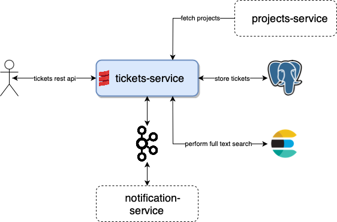

- `tickets-service` - CRUD for tasks tickets, also provides full text search capabilities, publish change to kafka topic
- `notification-service` - CRUD for user subscriptions, send emails for subscribed tickets.
- `users-service` - CRUD for users and details, such as team.
