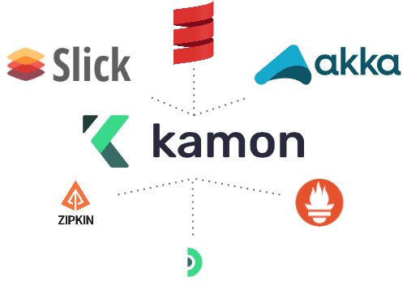
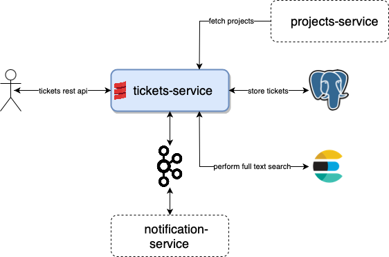
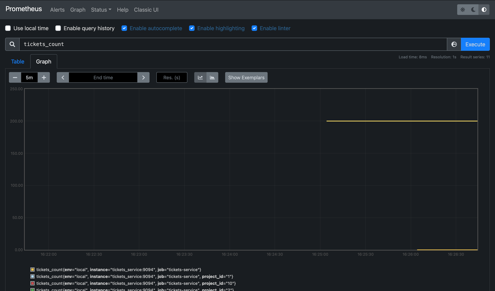
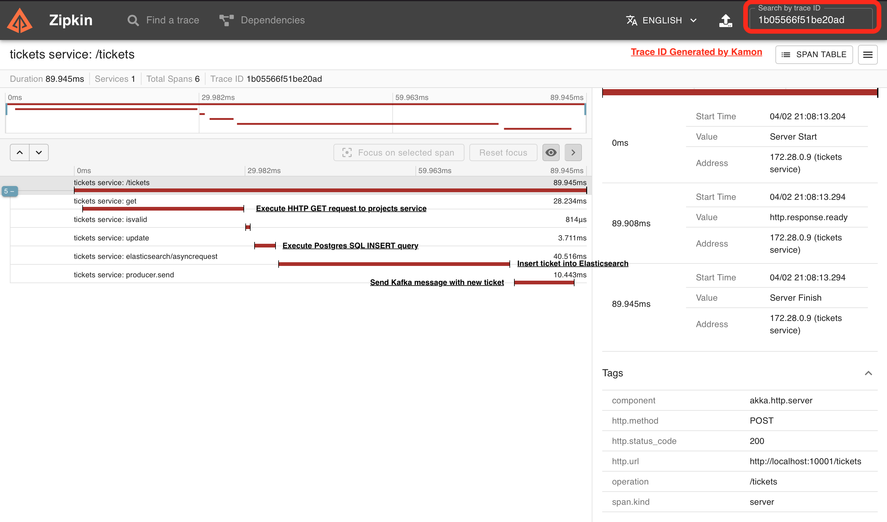
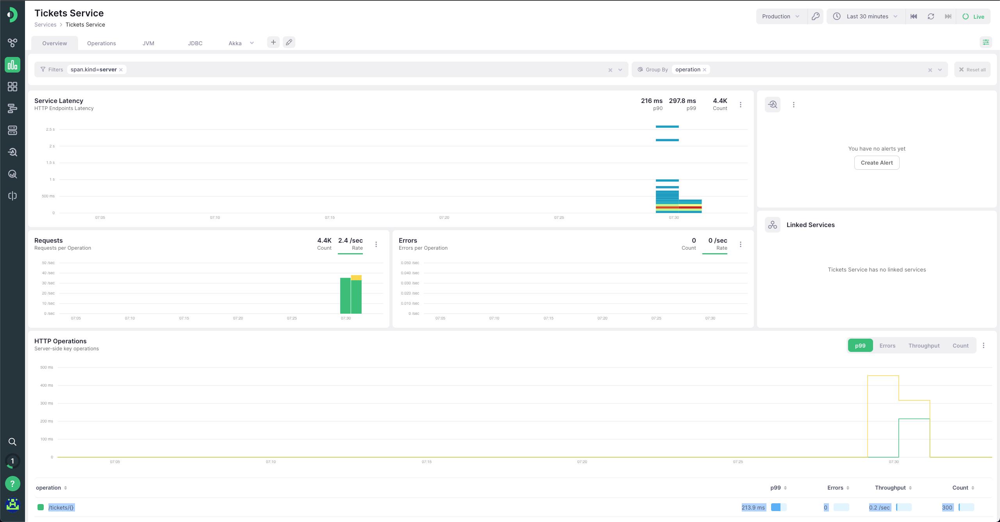
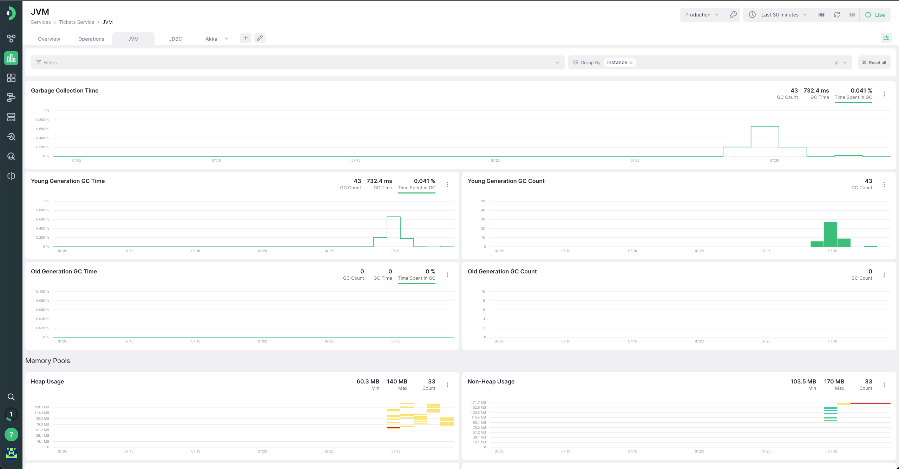
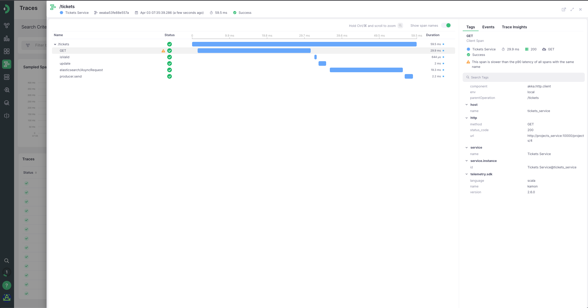

# Telemetry with Scala, part 2: Kamon


## Introduction
Welcome to the second part of our telemetry with Scala series! In the previous [post](https://medium.com/@ivan-kurchenko/telemetry-with-scala-part-1-opentelemetry-758c72a136e7), we introduced OpenTelemetry, a vendor-neutral open-source framework for generating, collecting, and exporting telemetry data. We explored how OpenTelemetry can help us gain visibility into the behavior of distributed systems by capturing traces, metrics, and logs.
In this post, we will dive into [Kamon](https://kamon.io), a popular telemetry solution for Scala applications. Kamon provides a range of powerful tools for monitoring and troubleshooting applications, including distributed tracing, metrics, and error tracking. We will walk through the key features of Kamon, how to configure it, and how to integrate it into a Scala application.
So let's explore Kamon and learn how it can help us monitor and improve the performance of our Scala applications.

## Previous part recap
Before proceeding, first, let's have a quick recap of the system under monitoring from the previous post.
This is a simple task ticketing (like Jira) service written on top of Akka HTTP and Slick and provides a very basic CRUD REST API for ticket management.



It uses the following external services:
- PostgreSQL database to store tickets;
- Kafka to publish events about tickets creation and update (for example, to send notifications to users);
- ElasticSearch for tickets full-text search;
- `project-service` to get information about a project to which the ticket belongs (mocked service);

For this service we would like to monitor a couple of simple things:
- Number of tickets in the system;
- Traces for each request;

To simulate user traffic (create, read, update, and delete tickets) Gatling load testing tool was used.

## Kamon
### Overview:
[Kamon](https://kamon.io) is a popular telemetry solution for monitoring and troubleshooting Scala applications. It provides a suite of tools for capturing and analyzing telemetry data, including distributed tracing, metrics, and error tracking. Kamon is designed to be lightweight and easy to use, with a simple API and minimal overhead.
Kamon provides, out of the box, a number of instrumentations like [Akka HTTP](https://kamon.io/docs/latest/guides/installation/akka-http/), [Spring Boot](https://kamon.io/docs/latest/guides/installation/spring-boot/), [Play Framework](https://kamon.io/docs/latest/guides/installation/play-framework/) and [Lagom](https://kamon.io/docs/latest/guides/installation/lagom-framework/).
The full list of supported instrumentation's can be found [here](https://kamon.io/docs/latest/instrumentation/)


Similarly to OpenTelemetry, Kamon has also concepts of [Tracing and Metrics](https://kamon.io/docs/latest/core/#core-apis).
Additionally, Kamon can wire additional context, which might help to debug certain traces. 


### How to plug instrumentation to an application
For a particular example case, we are interested in Akka instrumentation, which is described [here](https://kamon.io/docs/latest/guides/installation/akka-http/)
NOTE: At the moment of writing this blog post, the used version of Kamon is `2.6.0`. The latest version can be found [here](https://mvnrepository.com/artifact/io.kamon)

First of all, add Kamon dependencies to `build.sbt`:
```scala
lazy val kamonVersion = "2.6.0"
libraryDependencies += "io.kamon" %% "kamon-core" % kamonVersionl
libraryDependencies += "io.kamon" %% "kamon-bundle" % kamonVersion
```
`kamon-bundle` includes all instrumentation's that are available for the current version of Kamon, so we don't need to add each instrumentation separately.
But if you want to add only specific instrumentation's, you can do it by adding specific dependencies, for example:
```scala
libraryDependencies += "io.kamon" %% "kamon-akka-http" % kamonVersion
```

Then, we need to include [Kanela](https://kamon.io/docs/latest/guides/how-to/start-with-the-kanela-agent/) agent to our application, so to enable instrumentation's.
Make sure that you have `sbt-java-agent` plugin in your `project/plugins.sbt`:
```scala
addSbtPlugin("com.lightbend.sbt" % "sbt-javaagent" % "0.1.6")
```

After, add Kanela instrumentation agent to `build.sbt` [Using sbt-native-packager](https://kamon.io/docs/latest/guides/how-to/start-with-the-kanela-agent/#using-sbt-native-packager), so it can enable the agent at runtime.

```scala
enablePlugins(JavaAgent).settings(javaAgents += "io.kamon" % "kanela-agent" % "1.0.17")
```

### Metrics
Kamon provides several [metrics](https://kamon.io/docs/latest/core/metrics/) in its API.
To track number of tickets we can use `Gauge` metric:
```scala
val ticketsGauge: Gauge = Kamon.gauge("tickets_count", "Total number of tickets")
```

Kamon has tags to provide additional information about metric, similarly to OpenTelemetry's Java API [Attributes](https://javadoc.io/doc/io.opentelemetry/opentelemetry-api/latest/io/opentelemetry/api/common/Attributes.html).
So to track the number of created tickets per project we can use the following code:
```scala
ticketsGauge.withTag("project_id", ticket.project).increment()
```

### Metrics example: Prometheus
Kamon provides metrics-specific integrations for [Prometheus](https://kamon.io/docs/latest/reporters/prometheus/) and [InfluxDB](https://kamon.io/docs/latest/reporters/influxdb/).
Here we will use Prometheus to monitor the metrics of our application.

First, add to exporter dependency to `build.sbt`:
```scala
libraryDependencies += "io.kamon" %% "kamon-prometheus" % kamonVersion
```
Then we need to configure it in `application.conf`
```hocon
kamon { 
  prometheus {
    include-environment-tags = true
    embedded-server {
      hostname = 0.0.0.0
      port = 9094
    }
  }
}
```

Let's start the local Prometheus instance using `docker-compose` (partial example):
```yaml
prometheus:
  image: prom/prometheus:v2.33.3
  container_name: prometheus
  restart: always
  ports:
    - "9090:9090"
```
Don't forget to expose `9094` port (or specific for your needs) for `tickets-service` for Prometheus agent to scrap metrics.
Let's start the whole setup and run Gatling tests after. On Prometheus UI at `localhost:9090` we can find `tickets_count` metric:


As you can see, we have `project_id` tag for `tickets_count` metric, which is added by our application.

### Tracing example: Zipkin
Kamon provides tracing-specific integrations for [Zipkin](https://kamon.io/docs/latest/reporters/zipkin/) and [Jaeger](https://kamon.io/docs/latest/reporters/jaeger/).
Here we will use Zipkin to monitor traces of our application.

As in the previous example, firstly we need to add dependency to `build.sbt`:
```scala
libraryDependencies += "io.kamon" %% "kamon-zipkin" % kamonVersion
```

Then we need to configure exporter in `application.conf`
```hocon
kamon {
  zipkin {
   host = "localhost"
   host = ${?APPLICATION_ZIPKIN_HOST}
 
   port = 9411
   port = ${?APPLICATION_ZIPKIN_PORT}
 
   protocol = "http"
  }
}
```
Last but not least, we need to enable [Akka-HTTP tracing](https://kamon.io/docs/latest/instrumentation/akka-http/) in `application.conf`:
```hocon
kamon {
 instrumentation.akka.http {
  server {
   tracing {
    enabled = yes
    span-metrics = on
   }
  }

  client {
   tracing {
    enabled = yes
    span-metrics = on
   }
  }
 }
}
```

Let's start local Zipkin instance using `docker-compose` (partial example):
```yaml
zipkin:
  image: openzipkin/zipkin:2
  hostname: zipkin
  container_name: zipkin
  restart: always
  networks:
    - tickets
  ports:
    - "9411:9411"
```

Let's start the whole setup and create ticket with `POST /tickets` request.
Among response headers, you can find the value `trace-id` - `1b05566f51be20ad` which is a trace id of our request.
On Zipkin UI at `localhost:9411` we can find our trace:


This trace includes all requests made by our application, including requests to `projects-service`, queries to Postgres etc.

### APM Example: Kamon APM
Integrations with [Datadog](https://kamon.io/docs/latest/reporters/datadog/) and [New Relic](https://kamon.io/docs/latest/reporters/new-relic/) are also supported by Kamon.
But, among instrumentation's and libraries, Kamon also provides a commercial product called [Kamon APM](https://kamon.io/docs/latest/reporters/apm/). 
Kamon APM is a hosted commercial solution, which has native integration with Kamon library.

To plug Kamon APM reporter you need to add the following dependency
```scala
 "io.kamon" %% "kamon-apm-reporter" % "latest version"
```

The configuration looks pretty simple, all you need to do is to provide your API key:
```hocon
kamon {
  apm.api-key = "YOUR_API_KEY"
}
```

That's it - you're ready to go. Let's start `tickets_service` and Gatling tests after. You can find application metrics in Kamon APM dashboard immediately:


The great thing about Kamon APM is that it has pre-configured dashboards for JVM, JDBC, and Akka-specific metrics.


Additionally, tracing data is also available in a handy, such as finding trace by `trace-id` header value: 


You can find more about Kamon APM [here](https://kamon.io/docs/latest/apm)

### Conclusion 
In this blog post, we explored how to monitor a Scala-based backend application using Kamon framework.
It is a bit hard to choose between OpenTelemetry and Kamon as telemetry solutions for Scala & Lightbend stack, because they provide similar functionality in a very convenient way, such as automatic instrumentation.
Both OpenTelemetry and Kamon provide very similar metrics APIs ([Kamon metrics](https://kamon.io/docs/latest/core/metrics/) and [OTEL traces](https://opentelemetry.io/docs/concepts/signals/metrics/))
along with tracing ([Kamon traces](https://opentelemetry.io/docs/concepts/signals/traces/) and [OTEL traces](https://opentelemetry.io/docs/concepts/signals/traces/)).
Nonetheless, some pros and cons can be listed.

Kamon does not provide a mechanism for logs sending to external services like OpenTelemetry does with [OTLP Protocol](https://opentelemetry.io/docs/reference/specification/logs/).
But, there is plenty of ways to do this with other tools.
<br>The list of [OpenTelemetry's JVM instrumentation's](https://github.com/open-telemetry/opentelemetry-java-instrumentation/blob/main/docs/supported-libraries.md#libraries--frameworks) is certainly bigger than of [Kamon's](https://kamon.io/docs/latest/instrumentation/).
Another pitfall of Kamon is the limited number of [supported reporters](https://kamon.io/docs/latest/reporters/). While OpenTelemetry is vendor-agnostic by design.
<br>But, Kamon provides better native Scala API for creating custom Traces and Spans for instance for [Futures](https://kamon.io/docs/latest/instrumentation/futures/) and for [Akka actors](https://kamon.io/docs/latest/instrumentation/akka).  
  
If you are using multiple languages across your organization, or you have an existing complex monitoring solution, then it's probably better to stick with OpenTelemetry, as it's language and vendor agnostic.
But, if Scala and Akka ecosystem is your primary choice, then Kamon might be a better fit for you.

That's it for this time. In the next post, we will talk about [Trace4Cats](https://github.com/trace4cats/trace4cats/) in TypeLevel stack-based projects.

