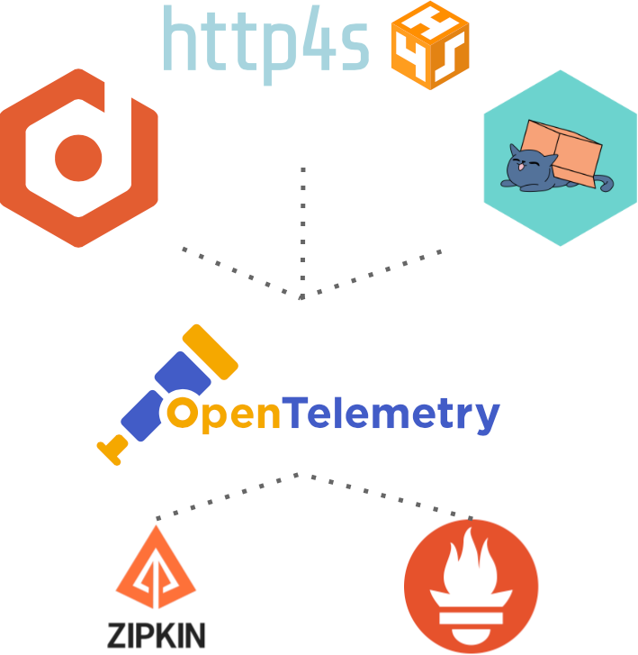

## Introduction
Introduction
- What this post is about, last in series

Trace4cats
- Overview:
    - description supported exports (zipkin, Jaeger etc),
    - supported instrumentation
    - Possible APM solutions to plug
    - otel4s https://github.com/typelevel/otel4s
    - 
- How to plug for our application
- Tracing example: Zipking
- Metrics example: Influx + Grafana
- APM Example: Splunk or Datalog
- Conclusion: couple words, pros, cons, compare with otel4s https://github.com/typelevel/otel4s


# Telemetry with Scala, part 3: trace4cats


## Introduction
Welcome to the third part of telemetry with Scala series! In previous posts, we explored [OpenTelemetry](https://medium.com/@ivan-kurchenko/telemetry-with-scala-part-1-opentelemetry-758c72a136e7) and [Kamon](https://medium.com/@ivan-kurchenko/telemetry-with-scala-part-2-kamon-5295dd9e3a1), two popular telemetry solutions for Scala and Akka based applications.
This time, the main focus shifter towards [cats-effect](https://typelevel.org/cats-effect/) ecosystem, and we will take a look at [otel4s](https://typelevel.org/otel4s/index.html).
We will walk through the key features of `otel4s`, how to configure it and how to integrate it into a Scala and pure functional application.
So, let's get started!

## System under monitoring recap
Before proceeding, first, let's have a quick recap of the system under monitoring. More details you can find in [Part 1](https://medium.com/@ivan-kurchenko/telemetry-with-scala-part-1-opentelemetry-758c72a136e7).
This is a simple task ticketing (like the Jira or Asana) service.


It uses the following external services:
- PostgresSQL database to store tickets;
- Kafka to publish events about tickets creation and update (for example, to send notifications to users);
- ElasticSearch for tickets full-text search;
- `project-service` to get information about a project to which the ticket belongs (mocked service);

This time it's going to be [cats-effect](https://typelevel.org/cats-effect/) based application.
In particular, the following libraries are used:
- [http4s](https://http4s.org/) - for both client (requesting `projects_service`) and server side (REST API);
- [doobie](https://tpolecat.github.io/doobie/) - to access PostgresSQL database;
- [fs2-kafka](https://fd4s.github.io/fs2-kafka/) - to publish events to Kafka;
- [elastic4s](https://github.com/sksamuel/elastic4s) - to access ElasticSearch;

For this service, we would like to monitor a couple of simple things:
- Number of tickets in the system;
- Traces for each request;

To simulate user traffic (create, read, update, and delete tickets), [Gatling](https://github.com/IvannKurchenko/blog-telemetry/blob/main/load_testing/src/test/scala/tickets/TicketsSimulation.scala) load testing tool was used.
Testing scenario is pretty simple: 10 users simultaneously create 10 tickets,
then search for them, update them and delete them.

## Scala observability ecosystem short overview
Before diving into `otel4` it is worth to mention that there are a couple of other libraries that can be used for telemetry:
- [trace4cats](https://github.com/trace4cats/trace4cats) - tracing library with rich functionality, support for multiple exporters and integrations;
- [natchez](https://typelevel.org/natchez/) - minimalistic tracing library for cats-effect ecosystem;

The main focus of mentioned frameworks is tracing and distributed tracing in particular. Described use case is a bit different,
because it requires a metrics collection as well. Because of this `otel4s` was chosen for to be used in this example.

## otel4s
As [the main page says](https://typelevel.org/otel4s/index.html), `otel4s` is:
> otel4s is an OpenTelemetry implementation for Scala. The design goal is to fully and faithfully implement the OpenTelemetry Specification atop Cats Effect.

But, please, note that this project is under active development:
> The API is still highly experimental, but we are actively instrumenting various libraries and applications to check for fit.

### How to plug
First of all, let's add `otel4s` to the project dependencies:

```scala
val opentelemetryVersion = "1.24.0"
val opentelemetryAlphaVersion = s"$opentelemetryVersion-alpha"
val otel4sVersion = "0.2.1"

libraryDependencies ++= Seq(
  "org.typelevel" %% "otel4s-java" % otel4sVersion,
  "io.opentelemetry" % "opentelemetry-sdk-extension-autoconfigure" % opentelemetryAlphaVersion,
  "io.opentelemetry" % "opentelemetry-exporter-prometheus" % opentelemetryAlphaVersion,
  "io.opentelemetry" % "opentelemetry-exporter-zipkin" % opentelemetryVersion,

  "io.opentelemetry.javaagent" % "opentelemetry-javaagent" % version % "runtime"
)
```
For the sake of example, two exporters were added: `Prometheus` and `Zipkin`. Adjust this list according to your needs.
For instance, you can use `opentelemetry-exporter-otlp` to send telemetry data to OTEL collector.

Add Java agent plugin to the `plugins.sbt`:
```scala
addSbtPlugin("com.lightbend.sbt" % "sbt-javaagent" % "0.1.6")
```

And enable it in `build.sbt`:
```scala
javaAgents += "io.opentelemetry.javaagent" % "opentelemetry-javaagent" % "1.24.0",
javaOptions += "-Dotel.java.global-autoconfigure.enabled=true",
```

In order to start working with it, we need to create an instance of `Otel4s`:
```scala
import cats.implicits._
import cats.effect.{Async, Concurrent, LiftIO, Resource, Sync}
import io.opentelemetry.api.GlobalOpenTelemetry
import org.typelevel.otel4s.Otel4s
import org.typelevel.otel4s.java.OtelJava

def otelResource[F[_]: Sync: Async: LiftIO]: Resource[F, Otel4s[F]] = {
    Resource
      .eval(Sync[F].delay(GlobalOpenTelemetry.get))
      .evalMap(OtelJava.forAsync[F])
}
```

Later we need to acquire two interfaces for tracing and metrics:
```scala
for {
  traceProvider: Tracer[F] <- otel.tracerProvider.get("tickets-service")
  metricsProvider: Meter[F] <- otel.meterProvider.get("tickets-service")
} yield (traceProvider, metricsProvider)
```

Note: `Tracer` needs to be added in implicit scope across the application, so make sure you have `F[_]: Tracer`.

### Metrics
Firstm let's start with metrics. In order to create a counter, we need to do the following:
```scala
ticketsCounter <- metricsProvider
  .upDownCounter("tickets_count")
  .withUnit("1")
  .withDescription("Tickets count")
  .create
```
API looks pretty similar to the native Java API, so we won't dive into details here.
More about the types of metrics you can find [here](https://opentelemetry.io/docs/concepts/signals/metrics/)
And then we can use it in scope of `IO`, like:
```scala
ticketsCounter.add(1, Attribute("project.id", ticket.id))
```

### Metrics example: Prometheus
To visualize metrics, we can use Prometheus. You can find instructions on how to configure it for OpenTelemetry in [Part 1]([Part 1](https://medium.com/@ivan-kurchenko/telemetry-with-scala-part-1-opentelemetry-758c72a136e7).  
After running load tests, we can see the following metrics:


Since OTEL java agent is used, we can also find JVM metrics:


### Tracing
Now, let's move to the most interesting part - tracing.
But there are couple nuances of using `otel4s` and Opentelemetry Java native instrumentation's.
The first one is that it stores `SpanContext` in 
[IOLocal](https://typelevel.org/cats-effect/docs/core/io-local) via [Vault](https://github.com/typelevel/vault). 
Another one is that Java implementation of traces relies on `ThreadLocal` storage for context propagation.
Because of having two runtimes (Java threads and Cats Effect fibers), it's pretty difficult to propagate context between them.
Hence, we need to implement own tracing middleware layer to be consistent with IO runtime and have proper context propagation among fibers.
Luckily, `otel4s` provides concise API for this.

There is ongoing work to implement set of instrumentation's for popular libraries.
For instance, Skunk is already to supports [`otel4s` out of the box](https://typelevel.org/skunk/tutorial/Tracing.html)

For `http4s` server side it could look following (imports eliminated):
```scala
trait ServerMiddleware {
  implicit class ServerMiddlewareOps[F[_] : Sync : Async : Tracer](service: HttpApp[F]) {
    def traced: HttpApp[F] = {
      Kleisli { (req: Request[F]) =>
        Tracer[F]
                .spanBuilder("handle-incoming-request")
                .addAttribute(Attribute("http.method", req.method.name))
                .addAttribute(Attribute("http.url", req.uri.renderString))
                .withSpanKind(SpanKind.Server)
                .build
                .use { span =>
                  for {
                    response <- service(req)
                    _ <- span.addAttribute(Attribute("http.status-code", response.status.code.toLong))
                    _ <- {
                      if (response.status.isSuccess) span.setStatus(Status.Ok) else span.setStatus(Status.Error)
                    }
                  } yield {
                    val traceIdHeader = Header.Raw(CIString("traceId"), span.context.traceIdHex)
                    response.putHeaders(traceIdHeader)
                  }
                }
      }
    }
  }
}
```

And then used like:
```scala
def app: HttpApp[F] = {
  HttpRoutes.of[F] {
    case req@POST -> Root / "tickets" =>
      for {
        create <- req.as[CreateTicket]
        ticket <- service.createTicket(create)
        resp <- Ok(ticket.asJson)
      } yield resp
  }
  .orNotFound
  .traced
}
```

For the `http4s` client side:
```scala
trait ClientMiddleware {
  implicit class ClientMiddlewareOps[F[_]: Tracer: Async, A](client: Client[F]) {
    def runTraced(request: Request[F]): F[Response[F]] = {
      Tracer[F].spanBuilder("client-request")
        .addAttribute(Attribute("http.method", request.method.name))
        .addAttribute(Attribute("http.url", request.uri.renderString))
        .withSpanKind(SpanKind.Client)
        .wrapResource(client.run(request))
        .build
        .use {
          case span @ Span.Res(response) =>
            for {
              _ <- span.addAttribute(Attribute("http.status-code", response.status.code.toLong))
              _ <- if (response.status.isSuccess) span.setStatus(Status.Ok) else span.setStatus(Status.Error)
            } yield response
        }
    }
  }
}
```

Usage example:
```scala
val request = Request[F](Method.GET, Uri.unsafeFromString(s"${configuration.url}/projects/$projectId"))
client.runTraced(request)
```

And for the `elastic4s` client:
```scala
trait ElasticMiddleware {
  implicit class ElasticMiddlewareOps[F[_]: Tracer: Async, A](client: ElasticClient) {
    def executeTraced[T, U](t: T)(implicit
                                  handler: Handler[T, U],
                                  javaTypeable: JavaTypeable[U],
                                  options: CommonRequestOptions): F[Response[U]] = {
      Tracer[F].span("elasticsearch").surround(
        Async[F].fromFuture(Async[F].pure(client.execute[T, U, Future](t)))
      )
    }
  }
}
```

Usage example:
```scala
def indexTicket(ticket: Ticket): F[Unit] = {
  client.executeTraced {
    indexInto("tickets").
    id(ticket.id.toString).
    source(ticket.toSearch).
    refresh(RefreshPolicy.Immediate)
  }.as(())
}
```

Minimalistic middleware for Kafka producer, using `fs2-kafka`:
```scala
trait KafkaProducerMiddleware {
  implicit class KafkaProducerMiddlewareOps[F[_] : Sync : Async : Tracer, K, V](producer: KafkaProducer[F, K, V]) {
    def produceOneTraced(topic: String, key: K, value: V): F[ProducerResult[K, V]] = {
      Tracer[F].span("kafka.produce", Attribute("kafka.topic", topic))
        .surround(producer.produceOne(topic, key, value).flatten)
    }
  }
}
```

And using it like:
```scala
private def send(event: TicketEvent): F[ProducerResult[String, TicketEvent]] = {
  KafkaProducer.resource(producerSettings)
  .use(_.produceOneTraced(kafka.topic, event.ticket.id.toString, event))
}
```

### Tracing example: Zipkin
After having all the tracing middleware in place, we can start tracing our application.
Let's setup Zipkin as a tracing backend and run the application.
You can find instructions on how to configure it for OpenTelemetry in [Part 1](https://medium.com/@ivan-kurchenko/telemetry-with-scala-part-1-opentelemetry-758c72a136e7).

Below you can see a screenshot of Zipkin UI with traces from our application for ticket creation flow:


All the code you can find in [this repository]()

### Conclusion 
In this article, we've seen how to use `otel4s` to instrument Scala applications with OpenTelemetry.
We've also seen how to use `otel4s` with `http4s`, `elastic4s`, `fs2-kafka` and `doobie`.
Despite the fact that `otel4s` is still in early development, it's already provides a lot of useful features and 
plug OpenTelemetry into your pure application.