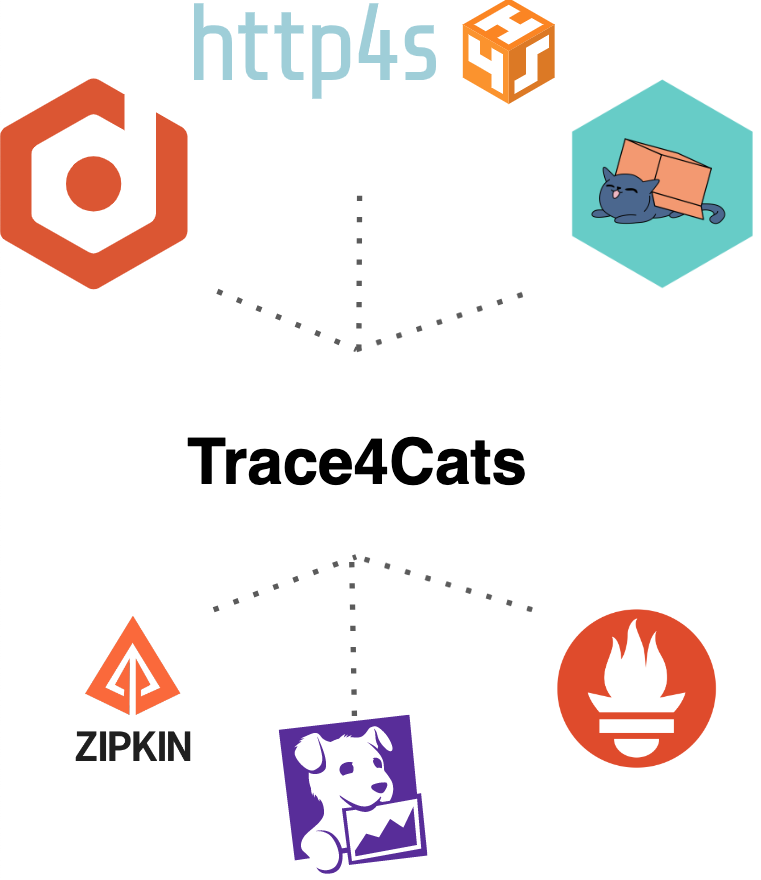

3rd article: trace4cats
Introduction
- What this post is about, last in series

Trace4cats
- Overview:
    - description supported exports (zipkin, Jaeger etc),
    - supported instrumentation
    - Possible APM solutions to plug
    - otel4s https://github.com/typelevel/otel4s
    - 
- How to plug for our application
- Tracing example: Zipking
- Metrics example: Influx + Grafana
- APM Example: Splunk or Datalog
- Conclusion: couple words, pros, cons, compare with otel4s https://github.com/typelevel/otel4s


# Telemetry with Scala, part 3: trace4cats


## Introduction
Welcome to the third part of telemetry with Scala series! In previous posts, we explored [OpenTelemetry](https://medium.com/@ivan-kurchenko/telemetry-with-scala-part-1-opentelemetry-758c72a136e7) and [Kamon](https://medium.com/@ivan-kurchenko/telemetry-with-scala-part-2-kamon-5295dd9e3a1), two popular telemetry solutions for Scala and Akka based applications.
This time, main focus shifter towards [cats-effect](https://typelevel.org/cats-effect/) ecosystem, and we will take a look at [trace4cats](https://github.com/trace4cats/trace4cats_).
We will walk through the key features of `trace4cats`, how to configure it and how to integrate it into a Scala and pure functional application.
Along with this we also will take a look a bit at [otel4s](https://typelevel.org/otel4s/index.html) - a library that provides a bridge between OpenTelemetry and cats effect ecosystem.
So, let's get started!

## System under monitoring recap
Before proceeding, first, let's have a quick recap of the system under monitoring.
This is a simple task ticketing (like Jira) service. This time we will be the [cats-effect](https://typelevel.org/cats-effect/) based application.
In particular, the following libraries were used:
- [http4s](https://http4s.org/) for both client (requesting `projects_service`) and server side (REST API); 
- [doobie](https://tpolecat.github.io/doobie/) to access PostgreSQL database;
- [fs2-kafka](https://fd4s.github.io/fs2-kafka/) to publish events to Kafka;
- [elastic4s](https://github.com/sksamuel/elastic4s) to access ElasticSearch;

As a side note, apart from mentioned used libraries `trace4cats` also provides instrumentation support for `tapir` and `fs2`,
which are not used in this example.


It uses the following external services:
- PostgreSQL database to store tickets;
- Kafka to publish events about tickets creation and update (for example, to send notifications to users);
- ElasticSearch for tickets full-text search;
- `project-service` to get information about a project to which the ticket belongs (mocked service);

For this service, we would like to monitor a couple of simple things:
- Number of tickets in the system;
- Traces for each request;

To simulate user traffic (create, read, update, and delete tickets), [Gatling](https://github.com/IvannKurchenko/blog-telemetry/blob/main/load_testing/src/test/scala/tickets/TicketsSimulation.scala) load testing tool was used.
Testing scenario is pretty simple: 10 users simultaneously create 10 tickets,
then search for them, update them and delete them.

## trace4cats
### Overview:
Tracing library with rich functionality and support for multiple exporters.
Tracing and distributed tracing in particular is it's main focus. 
Because of this it does not support metrics collection, so in order to build complete telemetry solution within an application, it should be combined with other libraries.
Supports many exporters, including OpenTelemetry, Jaeger, Zipkin, DataDog, NewRelic, etc.
There are plenty of tracing functionality.


what it can do and what instrumentation it provides.
What it is based on? In this example we will focus on OTEL, but it provides support for other exporters as well.

Supports multiple collectors()


According to the docs heave inspired on [Natches](https://typelevel.org/natchez/overview.html). 
And Nutches seems like not finished project, which providers good skeleton but there is no provided instrumentations and exporters.

On the other hand, there is https://github.com/typelevel/otel4s which is a bridge between OpenTelemetry and cats effect ecosystem.
Tracing functionality overlaps with trace4cats, which can cause some confusion.

Hence in scope of this blog post final setup for `tickets-service` telemetry will be the following:
- `OpenTelemetry` as a main telemetry solution and backend for all telemetry data;
- `trace4cats` as main tracing library for the application, because of instrumentation support and rich functionality;
- `otel4s` as a main metrics library;

### How to plug instrumentation to an application

There are many ways to convfigure trace4cats,
(even though HTTP API  - https://github.com/trace4cats/trace4cats-docs/blob/master/docs/design.md)


http4s:
https://github.com/trace4cats/trace4cats-docs/blob/master/docs/examples.md#http4s
https://github.com/trace4cats/trace4cats-docs/blob/master/modules/example/src/main/scala/trace4cats/example/Http4sExample.scala

fs2:
https://github.com/trace4cats/trace4cats-docs/blob/master/docs/examples.md#fs2
https://github.com/trace4cats/trace4cats-docs/blob/master/modules/example/src/main/scala/trace4cats/example/Fs2Example.scala

https://github.com/trace4cats/trace4cats-docs/blob/master/docs/examples.md#fs2-advanced
https://github.com/trace4cats/trace4cats-docs/blob/master/modules/example/src/main/scala/trace4cats/example/Fs2AdvancedExample.scala


ElasticSearch:
elasticsearch - auto instrumentation via OTEL + custom span coverage
doobie - auto instrumentation via OTEL (JDBC) + custom span coverage


### Metrics

Aside note, http4s provide milldeware to expose Prometheus metrics, but it is not a part of trace4cats.
https://http4s.github.io/http4s-prometheus-metrics/

### Metrics example: Prometheus
localhost:9094 - see all metrics
TODO: Add screenshot with metrics

### Tracing
HOW TO PASS TRACING CONTEXT THOUGH IO AND APPLICATION (LOGS) TO ANOTHER SERVICE!
https://typelevel.org/cats-effect/docs/core/io-local

https://http4s.org/v0.21/api/org/http4s/server/middleware/RequestId$
```scala
equest.attributes.lookup(RequestId.requestIdAttrKey)
```

Custom spans - 


### Tracing example: Zipkin


### APM Example: DataDog


### Conclusion 


### References
https://github.com/trace4cats/trace4cats#documentation - trace4cats documentation
https://typelevel.org/cats-effect/docs/core/io-local - passing tracing context through IO
https://typelevel.org/otel4s/index.html - otel4s
https://www.youtube.com/watch?v=wPZlTcdlGmo - Distributed Application Tracing with Trace4Cats by Chris Jansen
