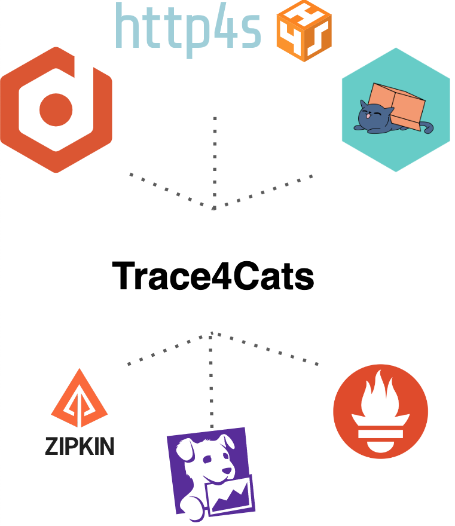

3rd article: trace4cats
Introduction
- What this post is about, last in series

Trace4cats
- Overview:
    - description supported exports (zipkin, Jaeger etc),
    - supported instrumentation
    - Possible APM solutions to plug
    - otel4s https://github.com/typelevel/otel4s
    - 
- How to plug for our application
- Tracing example: Zipking
- Metrics example: Influx + Grafana
- APM Example: Splunk or Datalog
- Conclusion: couple words, pros, cons, compare with otel4s https://github.com/typelevel/otel4s

# Telemetry with Scala, part 3: trace4cats

## Introduction
Welcome to the third part of telemetry with Scala series! In previous posts, we explored [OpenTelemetry](https://medium.com/@ivan-kurchenko/telemetry-with-scala-part-1-opentelemetry-758c72a136e7) and [Kamon](https://medium.com/@ivan-kurchenko/telemetry-with-scala-part-2-kamon-5295dd9e3a1), two popular telemetry solutions for Scala and Akka based applications.
This time, main focus shifter towards [cats-effect](https://typelevel.org/cats-effect/) ecosystem, and we will take a look at [trace4cats](https://github.com/trace4cats/trace4cats_).
We will walk through the key features of `trace4cats`, how to configure it and how to integrate it into a Scala and pure functional application.
Along with this we also will take a look a bit at [otel4s](https://typelevel.org/otel4s/index.html) - a library that provides a bridge between OpenTelemetry and cats effect ecosystem.
So, let's get started!

## System under monitoring recap
Before proceeding, first, let's have a quick recap of the system under monitoring.
This is a simple task ticketing (like Jira) service. This time we will be the [cats-effect](https://typelevel.org/cats-effect/) based application.
In particular, the following libraries were used:
- [http4s](https://http4s.org/) for both client (requesting `projects_service`) and server side (REST API); 
- [doobie](https://tpolecat.github.io/doobie/) to access PostgreSQL database;
- [fs2-kafka](https://fd4s.github.io/fs2-kafka/) to publish events to Kafka;
- [elastic4s](https://github.com/sksamuel/elastic4s) to access ElasticSearch;

As a side note, apart from mentioned used libraries `trace4cats` also provides instrumentation support for `tapir` and `fs2`,
which are not used in this example.

It uses the following external services:
- PostgreSQL database to store tickets;
- Kafka to publish events about tickets creation and update (for example, to send notifications to users);
- ElasticSearch for tickets full-text search;
- `project-service` to get information about a project to which the ticket belongs (mocked service);

For this service, we would like to monitor a couple of simple things:
- Number of tickets in the system;
- Traces for each request;

To simulate user traffic (create, read, update, and delete tickets), [Gatling](https://github.com/IvannKurchenko/blog-telemetry/blob/main/load_testing/src/test/scala/tickets/TicketsSimulation.scala) load testing tool was used.
Testing scenario is pretty simple: 10 users simultaneously create 10 tickets,
then search for them, update them and delete them.

## trace4cats
### Overview:
what it can do and what instrumentation it provides.
What it is based on? In this example we will focus on OTEL, but it provides support for other exporters as well.

### How to plug instrumentation to an application

### Metrics

Aside note, http4s provide milldeware to expose Prometheus metrics, but it is not a part of trace4cats.
https://http4s.github.io/http4s-prometheus-metrics/

### Metrics example: Prometheus

### Tracing
HOW TO PASS TRACING CONTEXT THOUGH IO AND APPLICATION (LOGS) TO ANOTHER SERVICE!

### Tracing example: Zipkin

### APM Example: DataDog

### Conclusion 

### References
https://github.com/trace4cats/trace4cats#documentation - trace4cats documentation